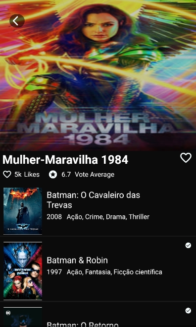

# Kotlin-TMDB-API-Retrofit-MVVM
Practicing the best coding habits and using some of the most recent libraries 

 In this project I was able to remember some interesting coding essentials fundamentals, 
also it was a great chance to practice my coding skills using an modern archicthture. 

 
<h3>The Main idea here was to recreate "TodoMovies4" screen</h3>
<a target = "_blank" href="https://apps.apple.com/br/app/todomovies-4/id792499896">TodoMovies4 App Link</a>
 

Although there were some trick steps I manage to got something pretty cool

<b>Email for contact: vitorsosilva@hotmail.com</b>

Hope you have enjoyed it :satisfied:

